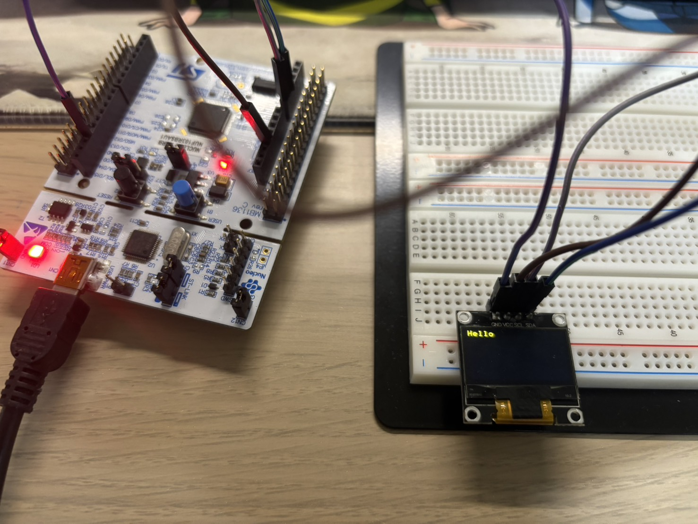

## Description
This project demonstrates a complete software-to-hardware integration for rendering text on an SSD1306 OLED display using an STM32F103 microcontroller. The implementation features a custom Software I2C (bit-banging) driver written entirely with direct register access. By utilizing a callback-based architecture, the high-level OLED library interfaces with the low-level bit-bang routines to perform complex tasks such as buffer management and string drawing without relying on hardware-specific I2C peripherals.

## Technical Specifications

### Hardware Configuration
| Peripheral | Pin | Mode | Function |
| :--- | :--- | :--- | :--- |
| **Software SCL** | PA0 | Output 2MHz, Open-Drain | Serial Clock Line |
| **Software SDA** | PA1 | Output 2MHz, Open-Drain | Serial Data Line |
| **OLED Display** | N/A | Slave (I2C) | SSD1306 128x64 Matrix |

### Implementation Details
The firmware architecture is divided into a low-level physical layer and a high-level application layer, both synchronized through register-level timing:

* **Register-Level GPIO Control**: 
    * The `RCC->APB2ENR` register is used to enable the clock for Port A.
    * The `GPIOA->CRL` register is manually configured using bitwise masks to set PA0 and PA1 as Open-Drain outputs, which is essential for the I2C bus electronic characteristics.
* **Atomic Bit Manipulation**: The implementation uses the **BSRR** (Bit Set Reset Register) for all SCL/SDA transitions. By writing to the lower 16 bits for "Set" and the upper 16 bits for "Reset," the code ensures atomic pin updates and avoids the hazards of read-modify-write cycles.
* **Bit-Banged I2C State Machine**: 
    * **Timing**: A precise `delay_u` function utilizing the `__NOP()` instruction provides the necessary setup and hold times for the 100-400kHz I2C frequency range.
    * **Data Integrity**: The `send_byte` function shifts data bits out via SDA and samples the **IDR** (Input Data Register) on the 9th clock pulse to verify the hardware Acknowledge (ACK) from the display.
* **Software Architecture (Callback Pattern)**: 
    * The project implements a decoupling pattern where the `OLED_SI2C_Write` function is passed as a function pointer (`i2c_write_cb`) to the OLED initialization structure. 
    * This allows the high-level rendering engine to execute `OLED_DrawString` while the low-level bit-banging driver handles the actual physical transmission.

---

### Register-Based Bit-Banging Snippet
The following code demonstrates the manual timing and register operations for sending a single byte and handling the ACK bit:

```c
static uint8_t send_byte(uint8_t byte) {
    for (int8_t i = 7; i >= 0; i--) {
        scl_w(0); // Set SCL Low via BSRR
        sda_w((byte & (1U << i)) ? 1 : 0); // Set SDA bit
        delay_u(1);
        scl_w(1); // Set SCL High via BSRR
        delay_u(1);
    }

    // 9th Clock: Release SDA and sample ACK from IDR
    scl_w(0);
    sda_w(1);
    delay_u(1);
    scl_w(1);
    delay_u(1);
    byte = (uint8_t)sda_r; // Read ACK state from GPIOA->IDR
    scl_w(0);
    
    return byte;
}
```
### Image Demo
