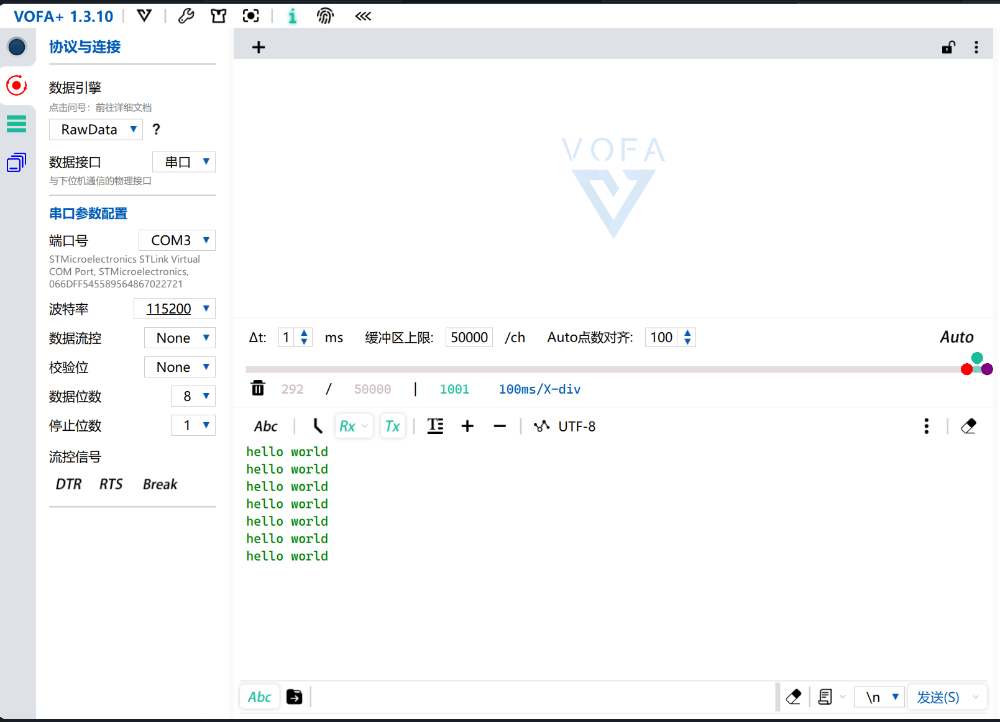

## Description
This project demonstrates the manual configuration of the USART2 peripheral on the STM32F103 microcontroller and the redirection of the standard `printf` function. The implementation focuses on direct register manipulation, bypassing high-level hardware abstraction layers to provide a clear view of the underlying ARM Cortex-M3 peripheral communication and initialization process.

## Technical Specifications

### Hardware Configuration
| Peripheral | Pin | Mode | Function |
| :--- | :--- | :--- | :--- |
| USART2 TX | PA2 | Alternate Function Push-Pull | Serial Data Output |
| USART2 RX | PA3 | Floating Input | Serial Data Input |
| System Clock | Internal/External | N/A | APB1 clocking for USART2 |

### Implementation Details
The project is built by directly addressing the memory-mapped registers of the STM32F103. Key implementation phases include:

* **Clock Management**: Direct modification of the `RCC->APB1ENR` and `RCC->APB2ENR` registers to enable power to the USART2 peripheral and GPIOA port.
* **Register-Level GPIO Setup**: Precise bitwise operations on the `GPIOA->CRL` register to assign PA2 and PA3 to the USART2 alternate function, ensuring the hardware triggers the correct signal paths.
* **USART Control**: 
    - **Baud Rate**: Manual calculation and assignment of the `USART2->BRR` register.
    - **Control Registers (CR1, CR2)**: Specific bit masking and setting to define 8-bit data length, parity disabling, and stop bit configuration.
    - **State Management**: Using the `TE` (Transmitter Enable) and `RE` (Receiver Enable) bits to prepare the hardware before activating the `UE` (USART Enable) bit.
* **Standard Library Redirection**: Overriding the `fputc` function to interface with the hardware. The function polls the `TXE` (Transmit Data Register Empty) flag in the `USART2->SR` (Status Register) before writing the character byte into the `USART2->DR` (Data Register).

---
### Demo Image

